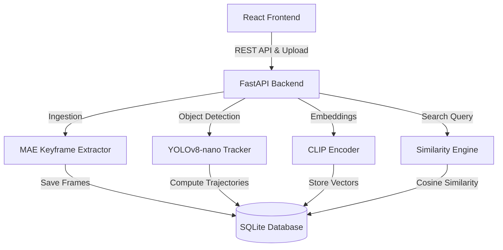

# OmniSight AI — Multi-Modal Video Intelligence System

OmniSight AI is a high-performance, local-first multi-modal video intelligence system featuring lightweight keyframe extraction, object velocity tracking, and zero-shot natural language vector search. It runs entirely offline to guarantee data privacy.

---

## 🌟 Key Features

* **Zero-Shot Natural Language Search**: Input query prompts like "a white car passing" or "someone running" and retrieve relevant keyframe matches immediately. Uses SentenceTransformers CLIP (`clip-ViT-B-32`) with SQLite embedding storage and fast vector similarity searches.
* **Object Velocity Tracking**: Detects objects with YOLOv8-nano and tracks centroids to measure object velocity in pixels per second.
* **Lightweight Keyframe Ingestion**: Leverages pixel-difference Mean Absolute Error (MAE) algorithms to dynamically extract keyframes during video upload and filters out redundant frames.
* **Modern Analytics Dashboard**: Premium web UI offering video uploads, real-time overlays of tracked objects with bounding boxes/speed metrics, and visual semantic search galleries.

---

## 🏗️ Architecture



---

## 📂 Project Structure

* [backend/](file:///Users/arryasridhar/Documents/Omni-Sight/backend): FastAPI web application containing core logic, storage adapters, models encoders, and automated tests.
* [frontend/](file:///Users/arryasridhar/Documents/Omni-Sight/frontend): React/Tailwind frontend compiled with Vite.
* [specs/001-omnisight-video-intelligence/](file:///Users/arryasridhar/Documents/Omni-Sight/specs/001-omnisight-video-intelligence):
  * [spec.md](file:///Users/arryasridhar/Documents/Omni-Sight/specs/001-omnisight-video-intelligence/spec.md): Functional requirements & User stories.
  * [plan.md](file:///Users/arryasridhar/Documents/Omni-Sight/specs/001-omnisight-video-intelligence/plan.md): Technical architecture and data models.
  * [tasks.md](file:///Users/arryasridhar/Documents/Omni-Sight/specs/001-omnisight-video-intelligence/tasks.md): Phase implementation checklist.
  * [quickstart.md](file:///Users/arryasridhar/Documents/Omni-Sight/specs/001-omnisight-video-intelligence/quickstart.md): Setup walkthrough and dependency install instructions.
  * [walkthrough.md](file:///Users/arryasridhar/Documents/Omni-Sight/specs/001-omnisight-video-intelligence/walkthrough.md): Phase completion reports and test outputs.
* [.specify/memory/constitution.md](file:///Users/arryasridhar/Documents/Omni-Sight/.specify/memory/constitution.md): Project engineering guardrails and privacy constraints.

---

## 🚀 Getting Started

Read the detailed [Quickstart Guide](file:///Users/arryasridhar/Documents/Omni-Sight/specs/001-omnisight-video-intelligence/quickstart.md) to install dependencies and configure local execution.

### Backend Setup
1. Create a Python virtual environment:
   ```bash
   cd backend
   python3 -m venv .venv
   source .venv/bin/activate
   pip install -r requirements.txt
   ```
2. Start the FastAPI development server:
   ```bash
   uvicorn src.main:app --host 0.0.0.0 --port 8000 --reload
   ```

### Frontend Setup
1. Install node dependencies:
   ```bash
   cd frontend
   npm install
   ```
2. Launch the Vite development server:
   ```bash
   npm run dev
   ```

### Running Tests
Execute the offline test suite:
```bash
cd backend
pytest
```
