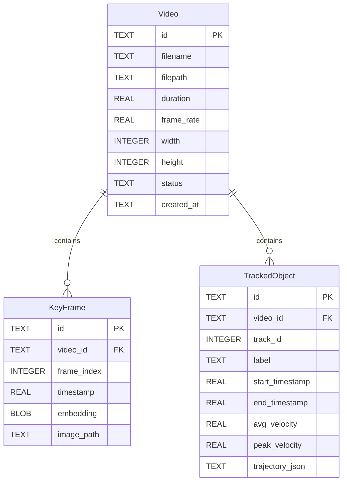
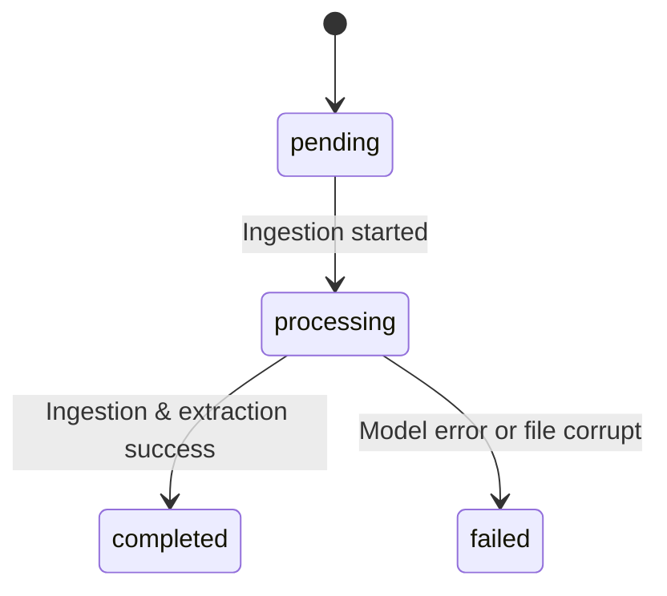

# Data Model: OmniSight AI

This document defines the SQLite database schema and entities for OmniSight AI.



## Entity Definitions

### 1. Video
Represents an ingested video file.
- `id` (TEXT, PK): Unique UUID for the video.
- `filename` (TEXT): Name of the file.
- `filepath` (TEXT): Full local path to the video.
- `duration` (REAL): Bounded positive duration in seconds.
- `frame_rate` (REAL): Video frames per second.
- `width` (INTEGER): Resolution width in pixels.
- `height` (INTEGER): Resolution height in pixels.
- `status` (TEXT): Current state of processing. Enum: `["pending", "processing", "completed", "failed"]`.
- `created_at` (TEXT): ISO-8601 timestamp.

### 2. KeyFrame
Represents a visually significant frame extracted from a video.
- `id` (TEXT, PK): Unique UUID.
- `video_id` (TEXT, FK): References `Video.id`. On delete cascade.
- `frame_index` (INTEGER): The frame index in the source video (0-indexed).
- `timestamp` (REAL): Offset in seconds from video start.
- `embedding` (BLOB): 512-dimensional float32 vector serialized to binary (2048 bytes).
- `image_path` (TEXT): Local path to the saved JPEG file of the keyframe.

### 3. TrackedObject
Represents an object detected and tracked over a sequence of frames.
- `id` (TEXT, PK): Unique UUID.
- `video_id` (TEXT, FK): References `Video.id`. On delete cascade.
- `track_id` (INTEGER): Unique ID assigned by the tracker within this video.
- `label` (TEXT): Class name (e.g., "car", "person").
- `start_timestamp` (REAL): Time the object first appeared (seconds).
- `end_timestamp` (REAL): Time the object last appeared (seconds).
- `avg_velocity` (REAL): Average speed in pixels/second.
- `peak_velocity` (REAL): Peak speed in pixels/second.
- `trajectory_json` (TEXT): JSON array of trajectory points. Format:
  ```json
  [
    {"frame_index": 120, "timestamp": 4.0, "bbox": [x, y, w, h], "velocity": 24.5},
    {"frame_index": 121, "timestamp": 4.03, "bbox": [x, y, w, h], "velocity": 26.1}
  ]
  ```

## State Transitions

